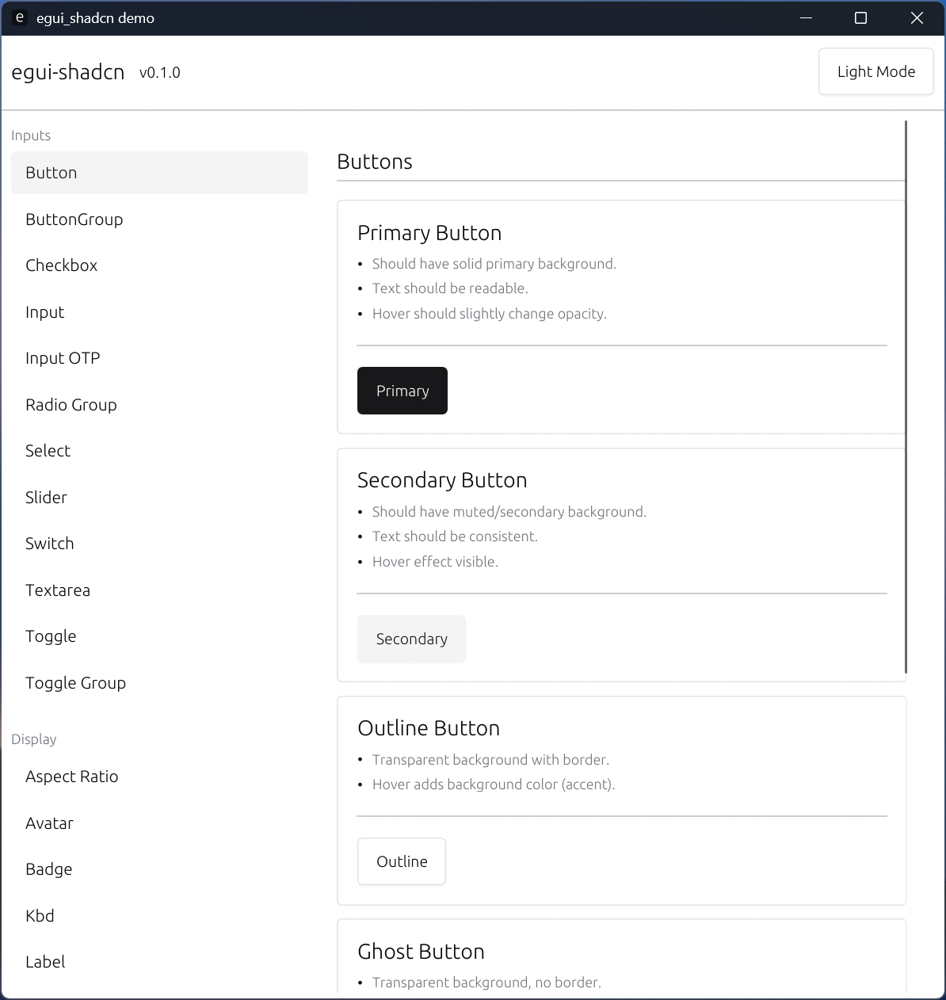
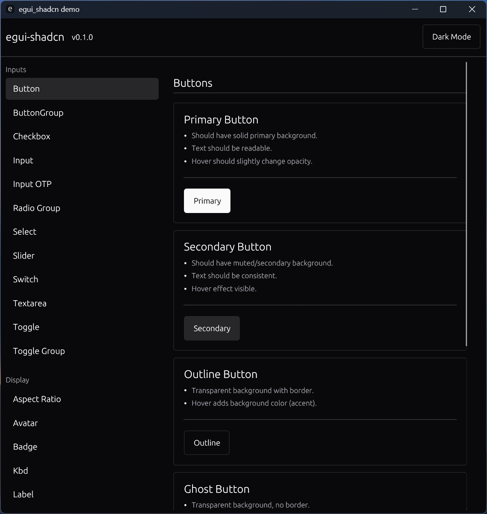

# egui-shadcn

A collection of UI widgets for [egui](https://github.com/emilk/egui) framework, inspired by [Shadcn/UI](https://ui.shadcn.com/).

## Previews

| Light Mode | Dark Mode |
| :---: | :---: |
|  |  |

## Features

Coming soon...

## License

MIT License. See [LICENSE](./LICENSE) for details.
